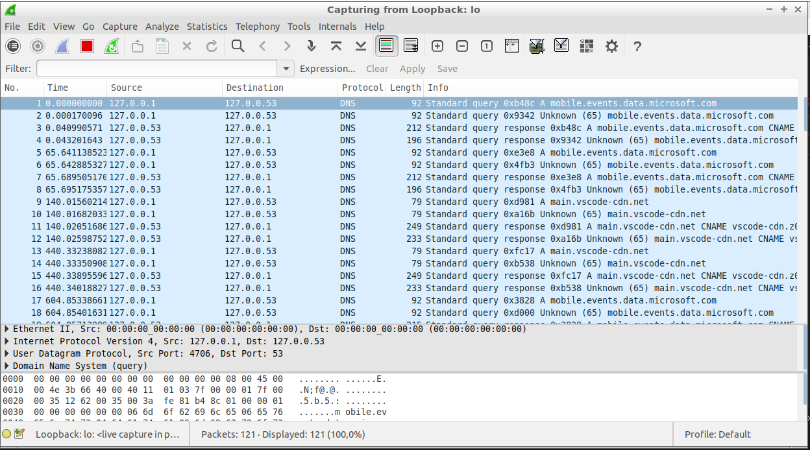
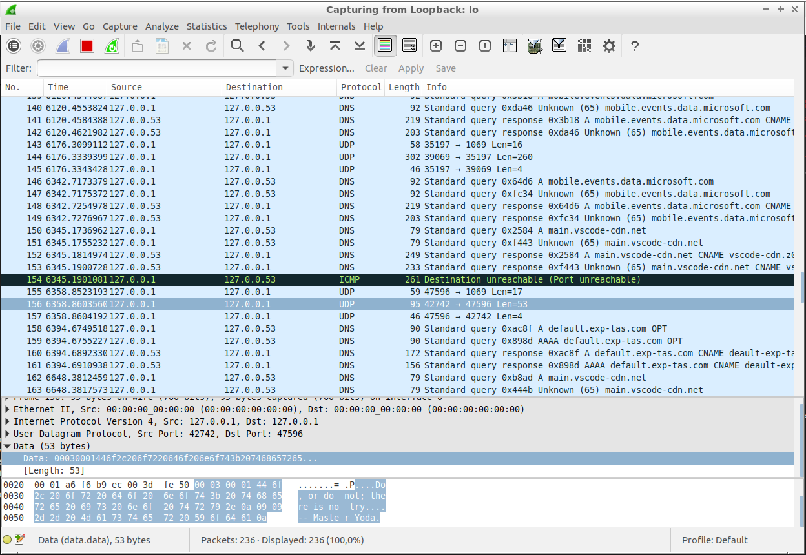

# TP synthese-TFTP client

## The aim of this tutorial is to create a client program capable of exchanging files using the TFTP (Trivial File Transfer Protocol).

When running the gettftp program, the client first resolves the server address using the getaddrinfo function. This step can be seen in the screenshot below, where the client queries the DNS server to obtain the IP address :

To do this, we first coded the RRQ request sent to the server. 
Once this request has been sent, the server responds with data packets (DAT). 
Each DAT packet contains :
- a 2-byte block number
- File data (up to 512 bytes per packet)
  
The client must receive these packets and send an acknowledgement (ACK) for each packet. This allows the server to know that the client has received the packet.
The ACK packet contains :
- the block number of the received data packet

Once the server address has been obtained, the program sends a read request (RRQ) to the TFTP server via the UDP protocol. The following screenshot shows this exchange : 

By creating a TFTP client, I learned how to manage network connections and transfer files using the UDP and TFTP protocols.

## Le but de ce tutoriel est de créer un programme client capable d'échanger des fichiers en utilisant le protocole TFTP (Trivial File Transfer Protocol).

Lors de l'exécution du programme gettftp, le client résout d'abord l'adresse du serveur à l'aide de la fonction getaddrinfo. Cette étape est illustrée dans la capture d'écran ci-dessous, où le client interroge le serveur DNS pour obtenir l'adresse IP :

Pour ce faire, nous avons d'abord codé la requête RRQ envoyée au serveur. 
Une fois cette requête envoyée, le serveur répond par des paquets de données (DAT). 
Chaque paquet DAT contient :
- un numéro de bloc de 2 octets
- les données du fichier (jusqu'à 512 octets par paquet).
  
Le client doit recevoir ces paquets et envoyer un accusé de réception (ACK) pour chaque paquet. Cela permet au serveur de savoir que le client a reçu le paquet.
Le paquet ACK contient :
- le numéro de bloc du paquet de données reçu

Une fois l'adresse du serveur obtenue, le programme envoie une demande de lecture (RRQ) au serveur TFTP via le protocole UDP. La capture d'écran suivante illustre cet échange : 

En créant un client TFTP, j'ai appris à gérer les connexions réseau et à transférer des fichiers en utilisant les protocoles UDP et TFTP.
