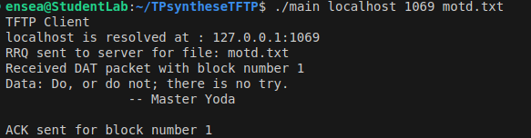

# TP synthese-TFTP client

##The aim of this tutorial is to create a client program capable of exchanging files using the TFTP (Trivial File Transfer Protocol).

When running the gettftp program, the client first resolves the server address using the getaddrinfo function. This step can be seen in the screenshot below, where the client queries the DNS server to obtain the IP address :

To do this, we first coded the RRQ request sent to the server. 
Once this request has been sent, the server responds with data packets (DAT). 
Each DAT packet contains :
- a 2-byte block number
- File data (up to 512 bytes per packet)
  
The client must receive these packets and send an acknowledgement (ACK) for each packet. This allows the server to know that the client has received the packet.
The ACK packet contains :
- the block number of the received data packet

Once the server address has been obtained, the program sends a read request (RRQ) to the TFTP server via the UDP protocol. The following screenshot shows this exchange : 

